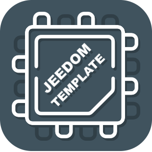

# Description

Plugin permettant de ....

description

# Market

Retrouvez le sur le Market Jeedom [ici](https://www.jeedom.com/market/index.php?v=d&p=market&type=plugin&&name=<Plugin>)
_˜Changer <Plugin> par le nom du plugin˜_

# Prévisualisation

_˜Inserer un screenshot du plugin en mode desktop˜_

